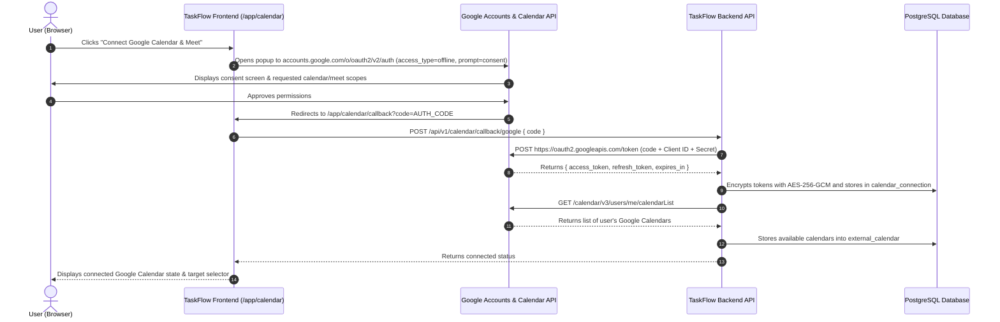

# 📅 Google Calendar & Google Meet Integration Workflow

This document details the complete end-to-end architecture, configuration, and runtime workflow for **Google Calendar** and **Google Meet** in TaskFlow, including the required setup in the **Google Cloud Console**.

---

## 1. Google Cloud Console Configuration

To enable Google Calendar synchronization and Google Meet integration, you must configure an OAuth 2.0 application in the Google Cloud Console.

### Step 1: Create a Project
1. Navigate to the [Google Cloud Console](https://console.cloud.google.com/).
2. Click the project dropdown in the top bar and select **New Project**.
3. Name the project (e.g., `TaskFlow-Production` or `TaskFlow-Dev`) and click **Create**.

### Step 2: Enable Required APIs
From the left navigation menu, go to **APIs & Services > Library**, search for and enable:
- **Google Calendar API**: Powers calendar list retrieval, event creation, synchronization, and deletion.
- **Google Meet REST API**: (`meet.googleapis.com`) Powers ad-hoc Meet space provisioning, recordings, and transcripts.
- **Google People API / Google OAuth2 API**: Used to fetch the authenticated user's profile and verified email.

### Step 3: Configure the OAuth Consent Screen
Go to **APIs & Services > OAuth consent screen**:
1. **User Type**:
   - Select **External** (for general public/multi-tenant use) or **Internal** (if restricted to a Google Workspace organization).
2. **App Information**:
   - **App name**: `TaskFlow`
   - **User support email**: Your support or admin email.
   - **Developer contact information**: Your email address.
3. **Scopes**:
   Click **Add or Remove Scopes** and add the following:
   - `openid`
   - `https://www.googleapis.com/auth/userinfo.email`
   - `https://www.googleapis.com/auth/userinfo.profile`
   - `https://www.googleapis.com/auth/calendar` (Read/write access to Calendars)
   - `https://www.googleapis.com/auth/calendar.events` (Manage events and Google Meet conference links)
   - `https://www.googleapis.com/auth/meetings.space.created` (Create Meet spaces)
4. **Test Users** *(if in Testing mode)*:
   - Add your test Google accounts so they can authenticate before the app is formally verified.

### Step 4: Create OAuth 2.0 Credentials
Go to **APIs & Services > Credentials**:
1. Click **+ CREATE CREDENTIALS** and choose **OAuth client ID**.
2. **Application type**: Select **Web application**.
3. **Name**: `TaskFlow Web Client`.
4. **Authorized JavaScript origins**:
   - `http://localhost:3000` *(for local development)*
   - `https://your-production-domain.com` *(for production)*
5. **Authorized redirect URIs**:
   - `http://localhost:3000/app/calendar/callback`
   - `https://your-production-domain.com/app/calendar/callback`
6. Click **Create** and securely copy:
   - **Client ID** → `NEXT_PUBLIC_GOOGLE_CLIENT_ID`
   - **Client Secret** → `GOOGLE_CLIENT_SECRET`

---

## 2. Environment Variables Checklist

Add these variables to your server environment (`apps/web/.env.local` for local Next.js server handlers or your backend secret manager):

```env
# Google OAuth Client Credentials (from Google Cloud Console)
NEXT_PUBLIC_GOOGLE_CLIENT_ID="your-client-id.apps.googleusercontent.com"
GOOGLE_CLIENT_SECRET="your-client-secret" # SERVER-ONLY: Never prefix with NEXT_PUBLIC_

# 32-byte hexadecimal key used to encrypt access & refresh tokens at rest with AES-256-GCM
CALENDAR_TOKEN_ENCRYPTION_KEY="your-32-byte-hex-secret-key" # SERVER-ONLY

# Base URL of the web application
NEXT_PUBLIC_APP_URL="http://localhost:3000"
```

> **Security Guardrail**: `GOOGLE_CLIENT_SECRET` and `CALENDAR_TOKEN_ENCRYPTION_KEY` must **never** have the `NEXT_PUBLIC_` prefix or be exposed to client-side bundles, browser storage, or AI prompt logs.

---

## 3. Google Calendar Architecture & Runtime Flow



### Detailed Lifecycle:
1. **OAuth 2.0 Consent & Offline Access**:
   - The user triggers calendar connection from the Sprint Calendar view.
   - The authorization URL is generated with `access_type=offline` and `prompt=consent`. This guarantees that Google returns a **`refresh_token`** alongside the short-lived `access_token` (1 hour).
2. **Server-Side Token Exchange**:
   - The frontend receives the one-time `code` at `/app/calendar/callback`.
   - The server exchanges the code for tokens via `https://oauth2.googleapis.com/token`.
3. **AES-256-GCM Encryption**:
   - Tokens are never stored in plaintext. They are encrypted using AES-256-GCM via `encryptCalendarToken()` before being persisted in the `calendar_connection` table.
4. **Calendar List Ingestion**:
   - Immediately following token storage, the server calls `https://www.googleapis.com/calendar/v3/users/me/calendarList`.
   - Discovered calendars (primary and secondary) are stored in the `external_calendar` table, allowing users to designate a specific calendar for task sync.
5. **Two-Way Synchronization**:
   - When sync runs (`/api/v1/calendar/sync/[id]`), active sprint tasks with due dates are mapped into Google Calendar event payloads (`summary`, `description`, `start`, `end`, and metadata).
   - Events are written via `POST https://www.googleapis.com/calendar/v3/calendars/{targetCalendarId}/events`.
6. **Automatic Token Refresh**:
   - If Google returns an `HTTP 401 Unauthorized` during any background sync, `refreshGoogleAccessToken()` decrypts the stored `refresh_token`, requests a fresh `access_token` from Google, updates the database, and resumes the sync seamlessly.

---

## 4. Google Meet Integration Workflow

Google Meet is integrated across TaskFlow in two distinct, real-time mechanisms:

### A. Team Collaboration & Chat Standups (Google Meet REST API v2)
- **Source Files**: `src/features/chat/components/ChatInputBar.tsx` & `SlashCommandPalette.tsx`
- **Workflow**:
  1. Team members start an instant meeting by typing `/meet` in any channel or direct message, or by clicking the video camera icon.
  2. The backend calls the **Google Meet REST API v2** (`POST https://meet.googleapis.com/v2/spaces`) with the `meetings.space.created` scope.
  3. Google generates an authenticated meeting space resource and clickable URI (e.g. `https://meet.google.com/abc-defg-hij`).
  4. The meeting is recorded in the `meeting` table with status `LIVE` and linked to the active workspace/project.
  5. A rich interactive card is injected into the real-time chat stream with the host name, meeting title, active status, and a direct **"Join Google Meet"** button.
  6. Clicking the button opens the real Google Meet room in a dedicated window or tab.

### B. Calendar Event Video Conferencing
- When TaskFlow schedules sprint reviews or milestone events via the Google Calendar API, it includes the `conferenceData` payload:
  ```json
  {
    "summary": "Sprint Planning & Review",
    "start": { "dateTime": "2026-10-01T10:00:00Z" },
    "end": { "dateTime": "2026-10-01T11:00:00Z" },
    "conferenceData": {
      "createRequest": {
        "requestId": "taskflow-meet-uuid",
        "conferenceSolutionKey": {
          "type": "hangoutsMeet"
        }
      }
    }
  }
  ```
- When passed with the query parameter `conferenceDataVersion=1`, Google automatically creates and binds a Google Meet video conference link directly to the calendar event and distributes it to all invitees.
- The resulting event ID and Meet URL are stored in the `meeting` table linked to the respective TaskFlow task or project.

---

## 5. Relevant Database Tables

| Table | Purpose |
| :--- | :--- |
| `calendar_connection` | Stores provider (`GOOGLE`), encrypted `access_token`, encrypted `refresh_token`, and connection status. |
| `external_calendar` | Stores individual calendars retrieved from Google Calendar API (primary flag, read/write permissions, timezone). |
| `meeting` | First-class relational entity linking `task_id`, `project_id`, `calendar_connection_id`, `external_event_id`, and `meeting_url`. |
| `calendar_sync_policy` | Controls sync preferences (e.g. `sync_tasks`, `sync_projects`, `default_task_duration_minutes`, `target_calendar_id`). |
| `calendar_event_mapping` | Cross-references TaskFlow task IDs and project IDs with external Google Calendar event IDs for bidirectional updates. |
| `chat_messages` | Stores chat messages and meeting attachments (including Google Meet links and meeting IDs). |

---

## 6. Implementation & Architecture Prompt
For the comprehensive, production-grade implementation prompt and phase-by-phase execution guide, refer to:
👉 **[GOOGLE_CALENDAR_MEET_INTEGRATION_PROMPT.md](file:///e:/AI/TaskFlow/TaskFlow/docs/GOOGLE_CALENDAR_MEET_INTEGRATION_PROMPT.md)**

---

## 7. Troubleshooting Common Issues

1. **Error: `redirect_uri_mismatch`**:
   - Ensure the exact URL (including port and protocol) `http://localhost:3000/app/calendar/callback` is listed under **Authorized redirect URIs** in your Google Cloud Console OAuth client.
2. **Missing Refresh Token**:
   - If Google does not return a `refresh_token`, ensure the authorization URL includes both `access_type=offline` and `prompt=consent`.
3. **Google Verification Warning ("Google hasn't verified this app")**:
   - During local development, this warning is expected for unverified apps. Click **Advanced > Go to TaskFlow (unsafe)** to proceed, or add your Google account as a **Test User** in the OAuth Consent Screen.
