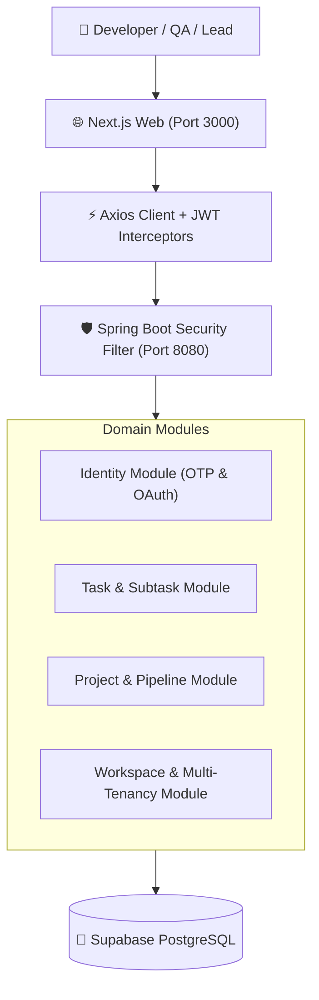

# 🏗️ System Overview Architecture

## 1. System Topology
TaskFlow is designed as a **Modular Monolith** with clean boundaries between sub-systems:
- **Presentation Layer**: Next.js 13.5 App Router (React 18, TypeScript 5, Tailwind CSS, Lucide).
- **Application & Domain Layer**: Spring Boot 3.3.4 (Spring Security 6, JJWT, Spring Data JPA).
- **Data Layer**: Supabase Cloud PostgreSQL with Flyway schema migration management (`V1`–`V10`).

---

## 2. Multi-Tenancy Hierarchy
Every resource belongs strictly to the tenant hierarchy:
$$\text{Organization} \longrightarrow \text{Workspace} \longrightarrow \text{Project} \longrightarrow \text{Task}$$
Data isolation is enforced at the database level and verified on every mutating API request.
