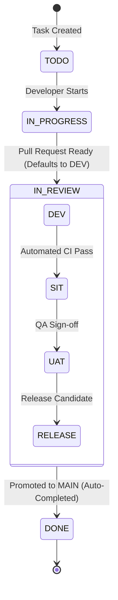

# 🔄 Task Lifecycle & Multi-Stage Environment Promotions

## 1. Lifecycle Progression
Every deliverable transitions through the following stages:

## 2. Business Rules
1. **DEV Review Default**: When a task moves to `in_review`, the review environment is initialized strictly to `DEV`.
2. **Project Environment Subsets**: Projects specify their active stages (*e.g. `['DEV', 'UAT', 'MAIN']`*). Tasks only cycle through enabled stages.
3. **MAIN Auto-Completion**: Promoting an environment to `MAIN` automatically sets `status = done` and completes the deliverable.
